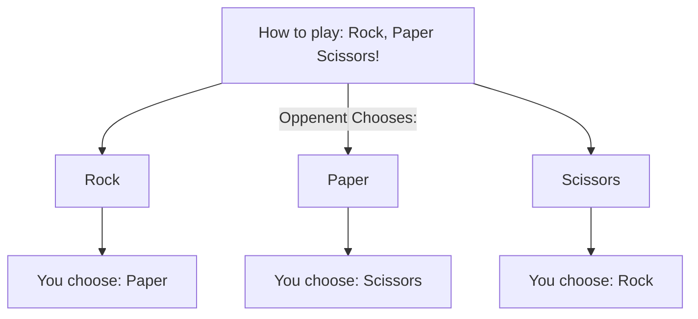
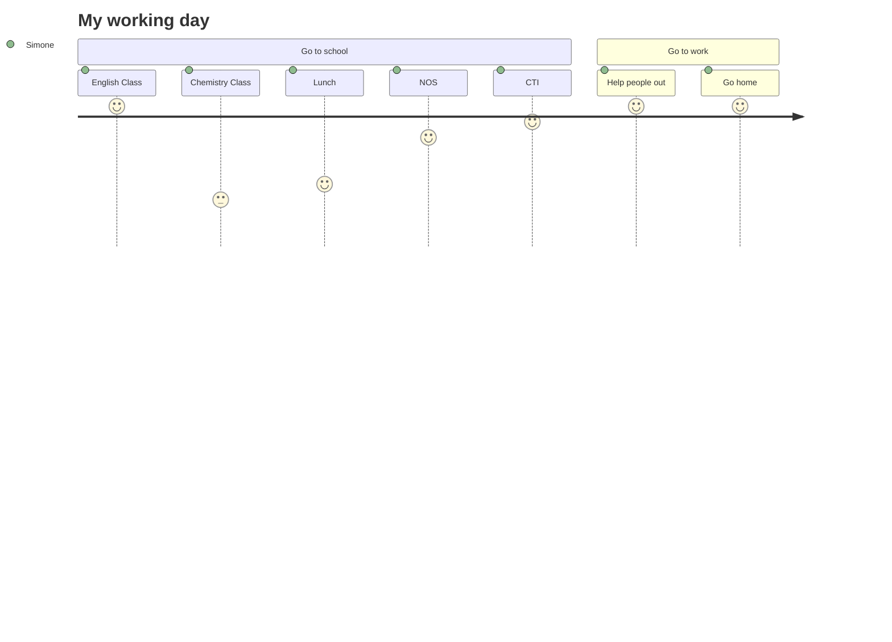

Simone Brown - smbrown22@my.waketech.edu 
Made on 9/25/2024 
Basic Repository for Assignment 
Cloned after reading instructions 

# **About Me**
## My Interests
> I love to **read**, to _write_, and **_code_**! I also love playing video games. 
### My Favorite Websites 
> * [Youtube] (www.youtube.com) -- Youtube is a fun site to watch pretty much anything you might want! 
> * [GitHub] (www.github.com) -- GitHub is a super cool website for using to learn how 
> * [Replit] (www.replit.com) -- The best place to code with Python, Replit is awesomeee! 
> * [TikTok] (www.tiktok.com) -- I need my content farm to function nowadays 
### Top Ten Ice Creams At Work By Popularity 
1. Butter Pecan
2. Pretzel Caramel Crunch  
3. Triple Chocolate 
4. Rico Suave 
5. James Brownie Funky Jackhammer 
6. Smores Jackhammer 
7. Yummy Latte 
8. Boot Daddy 
9. Mint Chip 
10. Texas Two-Step 
### The Foods I Like! (And some I don't :p)
- [ ] Broccoli 
- [x] Burgers 
- [x] Ice Cream
- [ ] Popsicles
- [ ] Slushies 
- [x] Chicken Sandwiches 
- [x] Chicken Tenders 
- [x] Cheese
- [x] Chocolate 
- [ ] Bacon 

## Part One  

## Part Two 
